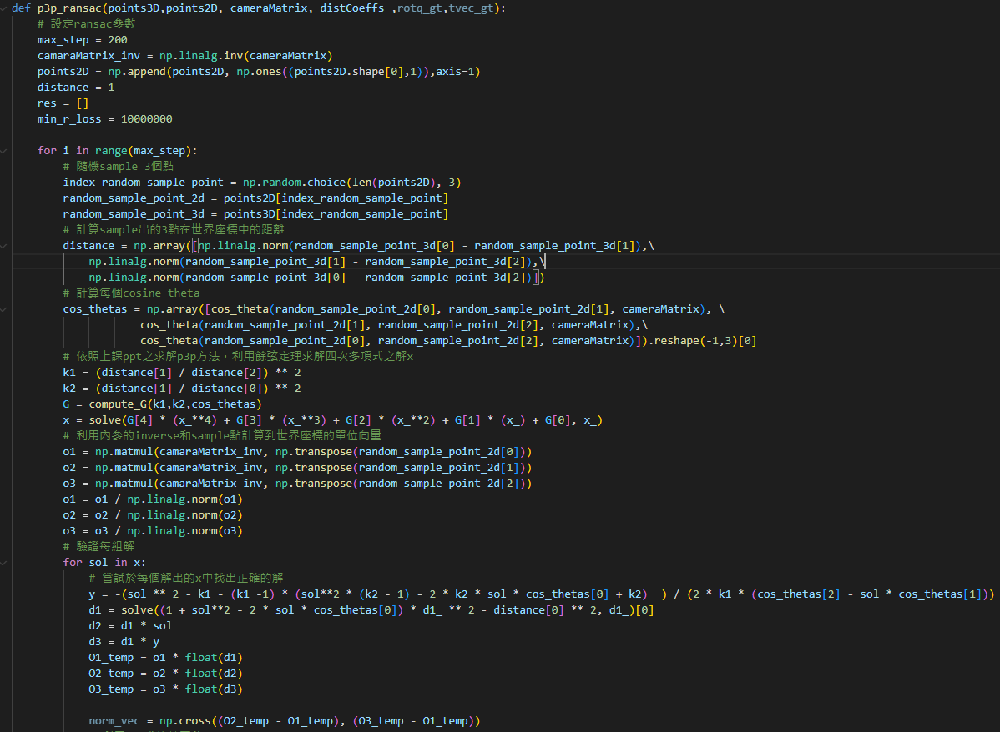
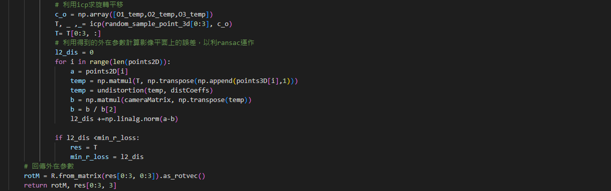

# NTU_3DCV-2022_HW2
> This is a homework for 3D Computer Vision with Deep Learning Applications.

The goal is to solve 2 problems:
1. 2D-3D Matching
    > For each validation image, compute its camera pose with respect to world coordinate. Find the 2D-3D correspondence by descriptor matching, and solve the camera pose. Implement at least one kind of algorithm that solves a PnP problem. Briefly explain your implementation and write down the pseudo code in your report.

    result:\
    implement P3P+RANSAC
    
    
    
    > Q1-2:For each camera pose you calculated, compute the median pose error (translation, rotation) with respect to ground truth camera pose. Provide some discussion.

    result:
    |Table of error|||
    |--|--|--|
    ||rotation|translation|
    |P3P + ransac (icp)|0.02759|0.07028|
    |cv2.solvePnPRansac(Using P3P)|0.00628|0.00411|

    > Q1-3: For each camera pose you calculated, plot the trajectory and camera poses along with 3d point cloud model using Open3D. Explain how you draw and provide some discussion.

    result:
    
    more results in [report](report.pdf)
2. Augmented Reality
    > Q2-1: With camera intrinsic and extrinsic parameters, place a virtual cube in the the validation image sequences to create an Augmented reality video. Draw the virtual cube as a point set with different colors on its surface. Implement a simply but efficient painter’s algorithm to determine the order of drawing.
    
    result: [demo video](https://youtu.be/XUBGQ43hTVI)

Dataset: [Download](https://drive.google.com/u/0/uc?export=download&confirm=qrVw&id=1GrCpYJFc8IZM_Uiisq6e8UxwVMFvr4AJ)
